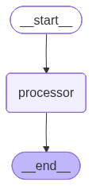
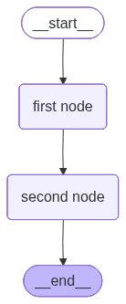
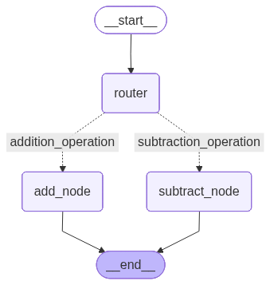

# Graphs

## Hello World Graph 01

### Objectives

- Understand and define the `AgentState` structure
- Create simple node functions to process and update state
- Set up a basic `LangGraph` structure
- Compile and invoke a LangGraph graph
- Understand how data flows through a single-node in `LangGraph`

### Simple example for Graph 1


### Installation

```bash
pip install langgraph IPython
```

### Import Required Libraries

```python
from typing import Dict, TypedDict
from langgraph.graph import StateGraph
```

`StateGraph` is a framework that helps you design and manage the flow of tasks in your application using a graph.

### Define AgentState and Node Function

```python
class AgentState(TypedDict):
    message: str

def greeting_node(state: AgentState) -> AgentState:
    """Simple node that adds a greeting message to the state"""
    state['message'] = "Hey " + state['message'] + ", how is your day going?"
    return state
```

`AgentState` is a shared data structure that keeps track of information as your application runs.

### Build and Compile the Graph

```python
graph = StateGraph(AgentState)

graph.add_node("greeter", greeting_node)
graph.set_entry_point("greeter")
graph.set_finish_point("greeter")

app = graph.compile()
```

### Exercise for Graph 1

#### Your task

Create a **Personalized Compliment Agent** using LangGraph!

**Input**: {"name": "Bob"}

**Output**: "Bob, you're doing an amazing job learning LangGraph!"

*Hint*: You have to concatenate the state, not replace it.

You can check the solution here: [Basic Graphs](../simple_graphs/01_Basic_Graphs.ipynb)

## Multiple Input Graphs 02

### Objectives (Multiple Input Graphs)

- Define a more complex `AgentState`
- Create a processing node that performs operations on **list data**
- Setup a `LangGraph` that processes and outputs computed result.
- Invoke the graph with structured inputs and retrieve outputs.

**Main Goal**: Learn how to handle multiple inputs

### Simple example for Graph 2



### Define AgentState with Multiple Fields

```python
class AgentState(TypedDict):
    values: List[int]
    name: str
    result: str
```

### Create Processing Node

```python
def process_values(state: AgentState) -> AgentState:
    """This function handles multiple different inputs from the state, 
    processes them, and updates the state with a result."""
    total = sum(state['values'])
    state['result'] = f"Hi there {state['name']}! The sum of your values is {total}."
    return state
```

### Build and Compile the Graph for 2

```python
graph = StateGraph(AgentState)
graph.add_node("processor", process_values)
graph.set_entry_point("processor")
graph.set_finish_point("processor")

app = graph.compile()
```

### Exercise for Graph 2

**Your task**: Create a **Graph** where you pass in a single list of integers along with a name and an operation. If the operation is a "+", you **add** the elements and if it is a "*", you multiply the elements, **All within the same node.**

**Input**: {"name": "Ashik", "values": [1, 2, 3, 5], "operation": "*+*"}

**Output**: "HI Ashik, your answer is: 30"

*Hint*: You need an if-statement in your node.

You can check the solution here: [Multiple Inputs](../simple_graphs/02_Multiple_Inputs.ipynb)

## Sequential Graph 03

### Objectives (Sequential Graph)

- Create **multiple** `Nodes` that sequentially process and update different parts of the state.
- Connect `Nodes` together in a graph.
- Invoke the `Graph` and see how the **state is transformed** step-by-step.

**Main Goal**: Create and handle multiple `Nodes`

### Simple example for Graph 3



### Import Required Libraries

```python
from typing import TypedDict
from langgraph.graph import StateGraph
```

### Define AgentState Schema

```python
class AgentState(TypedDict):  # Our state schema
  name: str
  age: str
  final: str
```

### Create Node Functions

```python
def first_node(state: AgentState) -> AgentState:
  """This is the first node in the graph"""

  state['final'] = f"Hello {state['name']}!"
  return state

def second_node(state: AgentState) -> AgentState:
  """This is the second node in the graph"""
  
  state['final'] += f" You are {state['age']} years old."
  return state
```

### Build and Compile the Sequential Graph

```python
graph = StateGraph(AgentState)
graph.add_node("first node", first_node)   # input: node and action
graph.add_node("second node", second_node) # input: node and action

graph.add_edge("first node", "second node")  # Connect the nodes in sequence
graph.set_entry_point("first node")           # Set the entry point of the graph
graph.set_finish_point("second node")        # Set the finish point of the graph
app = graph.compile()  # Compile the graph into an executable application
```

### Run the Sequential Graph

```python
answer = app.invoke({"name": "Ashik", "age": 25})  # Run the graph with initial state
print(answer["final"])  # Check the updated message in the state
# Output: "Hello Ashik! You are 25 years old."
```

### Exercise for Graph 3

**Your task**:

1. Accept a user's name, age, and a list of their skills.
2. Pass the state through **three nodes** that
   - First node: Personalizes the name field with a greeting.
   - Second node: Describes the user's age.
   - Third node: Lists the user's skills in a formatted string.
3. The final output in the result field should be **combined message** in this formate:

**Output**: "Ashik, welcome to the system! You are 31 years old! You have skills in: Python, Machine Learning, and LangGraph"

*Hint*: You will need the add_edge method twice.

You can check the solution here: [Sequential Graphs](../simple_graphs/03_Sequential_Graphs.ipynb)

## Conditional Graph 04

### Objectives (Conditional Graph)

- Implement `conditional` logic to route the flow of data to different nodes
- Use `Start` and `End` nodes to manage entry and exit points explicitly.
- Design multiple nodes to perform different operations (addition, subtraction).
- Create a `router node` to handle decision-making and control graph flow.

**Main Goal**: How to use `add_conditional_edges()`

### Simple example for Graph 4



### Import Required Libraries for graph 4

```python
from typing import TypedDict
from langgraph.graph import StateGraph, START, END
```

### Define AgentState for Conditional Logic

```python
class AgentState(TypedDict):
  number1: int
  number2: int
  operation: str
  result: int
```

### Create Operation Functions and Decision Logic

```python
def add_numbers(state: AgentState) -> AgentState:
  """This function adds two numbers and updates the state with the result."""
  state["result"] = state["number1"] + state["number2"]
  return state

def subtract_numbers(state: AgentState) -> AgentState:
  """This function subtracts two numbers and updates the state with the result."""
  state["result"] = state["number1"] - state["number2"]
  return state

def decide_next_node(state: AgentState) -> str:
  """This function decides the next node based on the operation specified in the state."""
  if state["operation"] == "+":
    return "addition_operation"
  elif state["operation"] == "-":
    return "subtraction_operation"
  else:
    raise ValueError("Invalid operation specified in the state.")
```

### Build and Compile the Conditional Graph

```python
graph = StateGraph(AgentState)

graph.add_node("add_node", add_numbers)
graph.add_node("subtract_node", subtract_numbers)
graph.add_node("router", lambda state: state)  # Router node

graph.add_edge(START, "router")  # Start with router

graph.add_conditional_edges(
  "router", 
  decide_next_node,
  {
    # Edge: Node
    "addition_operation": "add_node",
    "subtraction_operation": "subtract_node"
  }
)  # Route to addition or subtraction based on operation

graph.add_edge("add_node", END)  # End after addition
graph.add_edge("subtract_node", END)  # End after subtraction

app = graph.compile()
```

### Run the Conditional Graph

```python
# Addition example
result = app.invoke({"number1": 10, "number2": 5, "operation": "+"})
print("Result:", result["result"])  # Output: 15

# Subtraction example
result = app.invoke({"number1": 10, "number2": 5, "operation": "-"})
print("Result:", result["result"])  # Output: 5
```

### Exercise for Graph 4

**Your task**: Make the graph on the right! You will need to make use of 2 conditional edges!

**Input**: Initial_state = AgentState(number1 = 10, operation1="-", number2 = 5, number3 = 7, number4 = 2, operation2 = "+", finalNumber1 = 0, finalNumber2 = 0)

You can check the solution here: [Conditional Graphs](../simple_graphs/04_Conditional_Graph.ipynb)

## Looping Graph 05

### Objectives (Looping Graph)

- Implement `looping logic` to route the flow of data back to the nodes
- Create a single `conditional edge` to handle decision-making and control graph flow.

**Main Goal**: Coding up `Looping Logic`

### Simple example for Graph 5


### Exercise for graph 5

**Your task**:

Make the graph on the right! You need to implement an **Automatic Higher or Lower Game**.

Set the bounds to between 1 to 20. The Graph has to keep guessing (max number of guesses is 7) where if the guess is correct, then it stops, but if not we keep looping until we hit the max limit of 7.

Each time a number of guessed, the hind node should say higher or lower and the graph should account for this information and guess the next guess accordingly.

**Input**: ("player_name": "Student", "guesses": [], "attempts": 0, "lower_bound": 1)

*Hint*: It will need to adjust its bounds after every guess based on the hint provided by the hint node.

You can check the solution here: [Looping Graphs](../simple_graphs/05_Looping_Graph.ipynb)
