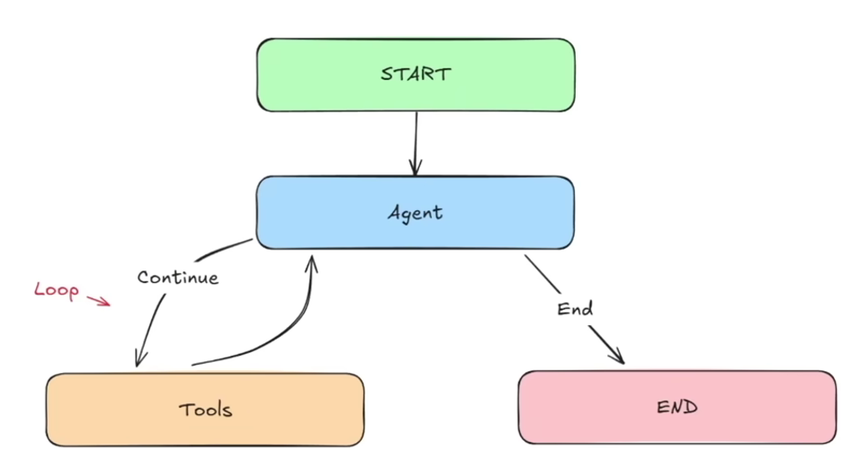

# AI Agent

## 01 Simple Bot

### Objectives

1. Define `state` structure with a list of `HumanMessage` objects.
2. Initialize a `GPT-4o` model using `LangChain's ChatOpenAI`
3. Sending and handling different types of messages
4. Building and compiling the graph of the `Agent`

**Main Goal**: How to integrate `LLMs` in our Graphs

### Implementation

```python
from typing import TypedDict, List
from langchain_core.messages import HumanMessage
from langchain_google_genai import ChatGoogleGenerativeAI
import os
from langgraph.graph import StateGraph, START, END
from dotenv import load_dotenv

load_dotenv()

class AgentState(TypedDict):
    messages: List[HumanMessage]

llm = ChatGoogleGenerativeAI(
    model="gemini-2.0-flash", 
    google_api_key=os.getenv("GOOGLE_API_KEY")
)

def process(state: AgentState) -> AgentState:
    response = llm.invoke(state["messages"])
    print(f"\nAI: {response.content}")
    return state

graph = StateGraph(AgentState)
graph.add_node("process", process)
graph.add_edge(START, "process")
graph.add_edge("process", END)
agent = graph.compile()

user_input = input("Enter: ")
while user_input != "exit":
    agent.invoke({"messages": [HumanMessage(content=user_input)]})
    user_input = input("Enter: ")
```

### Key Points

- Each invocation processes only the current message without conversation history
- The LLM is initialized with an API key from environment variables
- The graph has a single node that processes messages and returns the AI response

## 02 Chatbot

### Objectives for (02)

1. Use different message types - `HumanMessage` and `AIMessage`
2. Maintain a full conversation history using both message types
3. Use Gemini model using Langchain's `ChatGoogleGenerativeAI`
4. Create a sophisticated conversation loop

**Main Goal**: Create a form of memory for our Agent.

### Implementation 02

```python
from typing import List, TypedDict, Union
from langchain_core.messages import HumanMessage, AIMessage
from langchain_google_genai import ChatGoogleGenerativeAI
import os
from langgraph.graph import StateGraph, START, END
from dotenv import load_dotenv

load_dotenv()

class AgentState(TypedDict):
    messages: List[Union[HumanMessage, AIMessage]]

llm = ChatGoogleGenerativeAI(
    model="gemini-2.0-flash", 
    google_api_key=os.getenv("GOOGLE_API_KEY")
)

def process(state: AgentState) -> AgentState:
    response = llm.invoke(state["messages"])
    state["messages"].append(AIMessage(content=response.content))
    print(f"\nAI: {response.content}")
    return state

graph = StateGraph(AgentState)
graph.add_node("process", process)
graph.add_edge(START, "process")
graph.add_edge("process", END)
agent = graph.compile()

conversation_history = []
user_input = input("Enter: ")
while user_input != "exit":
    conversation_history.append(HumanMessage(content=user_input))
    result = agent.invoke({"messages": conversation_history})
    conversation_history = result["messages"]
    user_input = input("Enter: ")
```

### Key Points 02

- Maintains full conversation history with both `HumanMessage` and `AIMessage`
- Each AI response is appended to the state to preserve context
- The agent remembers previous interactions within a session

## 03 ReAgent



### Objectives for (03)

1. Learn how to create `Tools` in LangGraph
2. How to create a `ReAct Graph`
3. Work with different types of `Messages` such as `ToolMessages`
4. Test out robustness of our graph

**Main Goal**: Create a robust ReAct Agent!


## 03 ReAct Agent

### Key Concepts

**Annotated** - Provides additional context without affecting the type itself.

**Sequence** - Automatically handles state updates for sequences such as adding new messages to chat history.

**BaseMessage** - The foundation class for all message types in LangGraph.

**ToolMessage** - Passes data back to LLM after it calls a tool, including the content and tool name.

**SystemMessage** - Message for providing instructions to the LLM.

### Reducer Function: add_messages

The `add_messages` function is a reducer that controls how updates from nodes are combined with the existing state. It tells LangGraph how to merge new data into the current state.

**Without a reducer** - Updates replace the existing value entirely:
```python
state = {"messages": ["Hi!"]}  
update = {"messages": ["How are you?"]}
new_state = {"messages": ["How are you?"]}  # Old message lost
```

**With a reducer** - Updates are appended to the existing state:
```python
state = {"messages": ["Hi!"]}
update = {"messages": ["How are you?"]}
new_state = {"messages": ["Hi!", "How are you?"]}  # Both messages preserved
```

### Basic Structure

```python
from typing import Annotated, Sequence, TypedDict
from langchain_core.messages import BaseMessage
from langchain_google_genai import ChatGoogleGenerativeAI
from langgraph.graph.message import add_messages
from langgraph.graph import StateGraph, END
import os
from dotenv import load_dotenv

load_dotenv()

class AgentState(TypedDict):
    messages: Annotated[Sequence[BaseMessage], add_messages]

llm = ChatGoogleGenerativeAI(
    model="gemini-2.0-flash", 
    google_api_key=os.getenv("GOOGLE_API_KEY")
)
```

### Key Points

- Use `Annotated` with `add_messages` to automatically append messages instead of replacing them
- `Sequence[BaseMessage]` allows handling different message types
- Reducers are essential for maintaining conversation history in multi-node graphs
